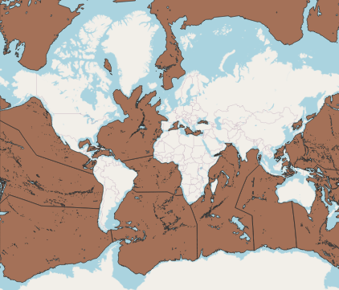
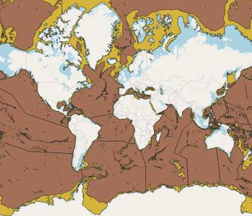

# Geographical Layers Related to Ballast Water Treatment and Exchange

Here we prepared a few geographical layers related to ballast water treatment and exchange in raster and vector format.

## Bathymetry

This layer shows the depth of ocean for two important threshold that is related to ballast water treatment and exchange. The data sourced to [natural earth](https://www.naturalearthdata.com/) which created from  [NASA's Shuttle Radar Topography Mission (SRTM Plus)](https://www2.jpl.nasa.gov/srtm/). 

### Bathymetry with depth of 2000meter

### Bathymetry with depth of 200meter

### Bathymetry with depth of 200meter and 2000 meter

