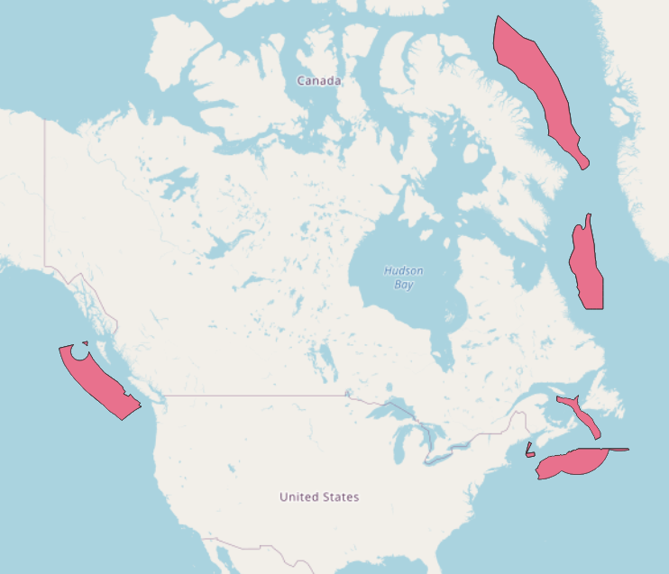

# Geographical Layers Related to Ballast Water Treatment and Exchange

Here we prepared a few geographical layers related to ballast water treatment and exchange in raster and vector format.

## Bathymetry

This layer shows the depth of ocean for two important threshold that is related to ballast water treatment and exchange. The data sourced to [natural earth](https://www.naturalearthdata.com/) which created from  [NASA's Shuttle Radar Topography Mission (SRTM Plus)](https://www2.jpl.nasa.gov/srtm/). 

### Bathymetry with depth of 2000meter


There are two formats of data available for this layer both are included in the `bathymetry_2000m` folder.  
The shape file includes all files starting with `ne_10m`. The raster file generated for this layer is in the raster folder. [bathymetry 2000 m](https://github.com/dfobaileylab/maps/blob/main/bathymetry_2000m/raster/Bathy2000mDepth.zip). This file includes two resolutions for this layer: each pixel is about 100 meter (for calculations), each pixel is about 2000 meters (for visualization)

### Bathymetry with depth of 200meter


### Bathymetry with depth of 200meter and 2000 meter


## Distance to Shore

## Canada's designated alternate ballast water exchange areas - Canada Alternate Ballast Water Exchange Areas

[source of data](https://open.canada.ca/data/en/dataset/23d26c61-b119-42c0-aa41-bd06cd96a973/resource/466c0c9c-b2da-43a4-8d35-489959d85a68?inner_span=True)

Create raster layers:
1. open shape file in ArcGIS Pro
2. add exchange field for all records in attribute table
3. under analyze/tools find Polygon to raster
4. select input feature and input field
5. set cell size to  0.01799 for ~ 2000 meters resolution [use 0.00089993 for ~ 100 meters resolution]
```
[2000m * 1 min/1852m ] * 1 deg/60min = 0.017999 DD
[100m * 1 min/1852m ]* 1 deg/60min = 0.00089993 DD
```
> Note that based on location on the earth a deg can have different distance. therefore, we use degree to show the accuracy of raster instead of meter.
6. go to environment tab. under extend as specified below define the `[-180..180]` and `[-90..90]` to cover the whole earth
7. run 
8. use raster calculator to fill the no data parts
9. add following condition `Con( IsNull("exchange_PolygonToRaster") ,0,"exchange_PolygonToRaster")`
10. go to environment tab. under extend as specified below define the -180..180 and -90..90 to cover the whole earth
11. the `tif` and `tfw` files will be ready after processing.

We processed for both resolution and the zip file is available [here](https://github.com/dfobaileylab/maps/blob/main/exchange/raster/exchange.zip) 

 

